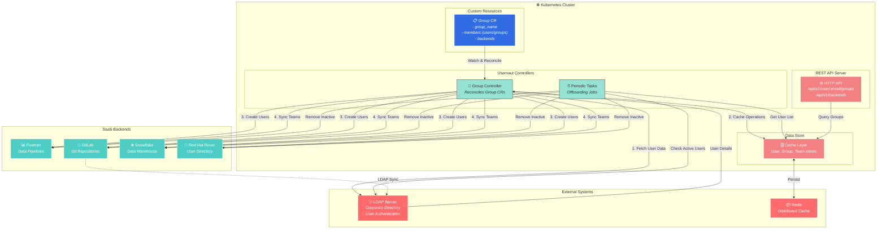

# Usernaut Developer Documentation

Welcome to Usernaut! This guide provides a comprehensive overview of the project architecture, core components, and development workflows. By the end of this document, you should have a solid understanding of how Usernaut works and be ready to contribute.

---

## Table of Contents

- [Overview](#overview)
- [Architecture](#architecture)
- [Core Components](#core-components)
  - [Custom Resource Definition (Group CRD)](#1-custom-resource-definition-group-crd)
  - [Group Controller](#2-group-controller-groupreconciler)
  - [Backend Clients](#3-backend-clients)
  - [Store Layer](#4-store-layer)
  - [Cache Layer](#5-cache-layer)
  - [Periodic Tasks Controller](#6-periodic-tasks-controller)
  - [HTTP API Server](#7-http-api-server)
- [Data Flow](#data-flow)
- [Configuration](#configuration)
- [Project Structure](#project-structure)
- [Getting Started](#getting-started)
- [Development Guidelines](#development-guidelines)
- [Testing](#testing)
- [Debugging](#debugging)
- [Troubleshooting](#troubleshooting)

---

## Overview

**Usernaut** is a Kubernetes Operator that manages user accounts and teams across multiple SaaS platforms. It leverages Kubernetes as the orchestration engine, providing a unified, declarative interface for:

- **Creating** user accounts across Fivetran, GitLab, Snowflake, and Red Hat Rover
- **Managing** team memberships consistently across all platforms
- **Synchronizing** user data from LDAP to backend systems
- **Automating** user offboarding when employees leave the organization

### Key Features

| Feature                    | Description                                          |
| -------------------------- | ---------------------------------------------------- |
| **Declarative Management** | Define user groups as Kubernetes Custom Resources    |
| **Multi-Backend Support**  | Fivetran, GitLab, Snowflake, Red Hat Rover           |
| **LDAP Integration**       | Fetches user details from corporate LDAP directory   |
| **Nested Groups**          | Groups can include other groups with cycle detection |
| **Automatic Offboarding**  | Removes inactive users from backends every 24 hours  |
| **REST API**               | Query user group memberships via HTTP                |

### How It Works (High Level)

1. **Admin creates a `Group` CR** specifying members (users/groups) and target backends
2. **GroupReconciler watches** for Group CR changes
3. **Controller fetches user data** from LDAP
4. **Controller syncs** users and team memberships to each backend
5. **Background job** periodically checks for inactive users and offboards them

---

## Architecture

```
┌─────────────────────────────────────────────────────────────────────────────┐
│                              Kubernetes Cluster                             │
├─────────────────────────────────────────────────────────────────────────────┤
│                                                                             │
│  ┌─────────────────┐         ┌───────────────────────────────────────────┐  │
│  │   Group CRD     │────────▶│              GroupReconciler              │  │
│  │   (v1alpha1)    │         │                                           │  │
│  │                 │         │  1. Fetch unique members (recursive)      │  │
│  │  - group_name   │         │  2. Acquire cache lock                    │  │
│  │  - members      │         │  3. Fetch LDAP data for each user         │  │
│  │  - backends[]   │         │  4. Process each backend:                 │  │
│  └─────────────────┘         │     - Create/get team                     │  │
│                              │     - Create users if needed              │  │
│                              │     - Add/remove team members             │  │
│                              │  5. Update cache indexes                  │  │
│                              │  6. Update CR status                      │  │
│                              └───────────────────┬───────────────────────┘  │
│                                                  │                          │
│  ┌─────────────────┐                             │                          │
│  │ Periodic Tasks  │                             ▼                          │
│  │   Controller    │         ┌───────────────────────────────────────────┐  │
│  │                 │         │            Backend Clients                │  │
│  │ UserOffboarding │         │                                           │  │
│  │   Job (24h)     │────────▶│  ┌──────────┐ ┌──────────┐ ┌───────────┐  │  │
│  │                 │         │  │ Fivetran │ │  GitLab  │ │ Snowflake │  │  │
│  │  - Check LDAP   │         │  └────┬─────┘ └────┬─────┘ └─────┬─────┘  │  │
│  │  - Remove users │         │       │            │             │        │  │
│  │  - Clean cache  │         │  ┌────┴────────────┴─────────────┴────┐   │  │
│  └─────────────────┘         │  │          Red Hat Rover             │   │  │
│                              │  └────────────────────────────────────┘   │  │
│                              └───────────────────┬───────────────────────┘  │
│                                                  │                          │
│  ┌─────────────────┐         ┌───────────────────┴───────────────────────┐  │
│  │   HTTP API      │         │              Store Layer                  │  │
│  │   Server        │────────▶│                                           │  │
│  │   (Gin)         │         │  ┌───────────┐ ┌───────────┐ ┌─────────┐  │  │
│  │                 │         │  │UserStore  │ │GroupStore │ │MetaStore│  │  │
│  │ GET /backends   │         │  └─────┬─────┘ └─────┬─────┘ └────┬────┘  │  │
│  │ GET /user/groups│         │        │             │            │       │  │
│  └─────────────────┘         │  ┌─────┴─────────────┴────────────┴────┐  │  │
│                              │  │         Cache (Redis/Memory)        │  │  │
│                              │  └─────────────────────────────────────┘  │  │
│                              └───────────────────────────────────────────┘  │
│                                                                             │
│  ┌───────────────────────────────────────────────────────────────────────┐  │
│  │                        External Dependencies                          │  │
│  │                                                                       │  │
│  │                        ┌──────────────┐                               │  │
│  │                        │  LDAP Server │                               │  │
│  │                        └──────────────┘                               │  │
│  └───────────────────────────────────────────────────────────────────────┘  │
│                                                                             │
└─────────────────────────────────────────────────────────────────────────────┘
```

### Architecture Highlights

- **Controller Pattern**: Follows the Kubernetes controller pattern - watch, reconcile, update status
- **Namespace-Scoped**: Watches only the `usernaut` namespace by default (configurable via `WATCHED_NAMESPACE` env var)
- **Shared Cache Mutex**: A `sync.RWMutex` shared between controllers prevents race conditions during cache read/write operations
- **All-or-Nothing Cache Updates**: Cache indexes (user:groups, group members, user_list) are only updated if ALL backends succeed. If any backend fails, no cache indexes are updated to maintain consistency. Individual user/team cache entries are updated per-backend during processing.
- **Finalizers**: Ensure proper cleanup when Group CRs are deleted
- **Preload on Startup**: Fetches all users/teams from all backends concurrently to populate cache before reconciliation begins
- **Leader Election**: Supports multi-replica deployments with leader election (LeaderElectionID: `dd1e5158.operator.dataverse.redhat.com`)
- **Circuit Breaker**: All backend clients use Hystrix circuit breaker pattern with connection pooling and retry logic
- **Health Probes**: Exposes `/healthz` and `/readyz` endpoints on port 8081 for Kubernetes health checks

## Flow Diagram



### Data Flow Summary

| Flow                 | Description                                                                                                |
| -------------------- | ---------------------------------------------------------------------------------------------------------- |
| **Reconciliation**   | Group CR changes trigger the controller to fetch LDAP data, update cache, and sync users/teams to backends |
| **User Onboarding**  | Controller creates users in configured backends and adds them to the appropriate teams                     |
| **Team Management**  | Teams are created/updated in backends based on Group CR spec; members are synced automatically             |
| **Auto-Offboarding** | Periodic job checks LDAP for inactive users and removes them from all backends                             |
| **API Queries**      | REST API serves user group membership info from the cache layer                                            |

---

## Core Components

### 1. Custom Resource Definition (Group CRD)

**Location**: `api/v1alpha1/group_types.go`

The `Group` CRD is the primary API for Usernaut. It defines:

```yaml
apiVersion: operator.dataverse.redhat.com/v1alpha1
kind: Group
metadata:
  name: dataverse-platform-team
  namespace: usernaut
spec:
  group_name: "dataverse-platform-team" # group name should match CR name
  members:
    users: # Direct user members (LDAP usernames)
      - "jsmith"
      - "mjohnson"
    groups: # Nested groups (references other Group CRs)
      - "dataverse-platform-admin"
  backends: # Target platforms
    - name: fivetran
      type: fivetran
    - name: gitlab
      type: gitlab
status:
  reconciledUsers: # List of reconciled users
    - "jsmith"
    - "mjohnson"
  conditions: # Standard Kubernetes conditions
    - type: GroupReadyCondition
      status: "True"
      message: "Group reconciled successfully"
  backends: # Per-backend status
    - name: fivetran
      type: fivetran
      status: true
      message: "Successful"
    - name: gitlab
      type: gitlab
      status: true
      message: "Successful"
```

**Key Types**:

| Type          | Description                                                      |
| ------------- | ---------------------------------------------------------------- |
| `GroupSpec`   | Desired state: group name, members, target backends              |
| `GroupStatus` | Observed state: reconciled users, conditions, backend statuses   |
| `Members`     | Contains `users` (direct) and `groups` (nested group references) |
| `Backend`     | Backend identifier with `name` and `type`                        |

---

### 2. Group Controller (GroupReconciler)

**Location**: `internal/controller/group_controller.go`

The heart of Usernaut. This controller watches Group CRs and ensures the actual state matches the desired state.

**Reconciliation Flow**:

```
┌─────────────────────────────────────────────────────────────────────────┐
│                         Reconcile() Function                            │
├─────────────────────────────────────────────────────────────────────────┤
│                                                                         │
│  1. Fetch Group CR                                                      │
│     └── If not found → return (deleted)                                 │
│     └── If deletion timestamp → handleDeletion()                        │
│                                                                         │
│  2. Add finalizer if missing                                            │
│                                                                         │
│  3. Set owner references (for nested groups)                            │
│                                                                         │
│  4. Set status to "Waiting"                                             │
│                                                                         │
│  5. Fetch unique members (recursive, cycle-aware)                       │
│     └── fetchUniqueGroupMembers() handles nested groups                 │
│     └── deduplicateMembers() removes duplicates                         │
│                                                                         │
│  6. Acquire cache mutex (shared lock)                                   │
│                                                                         │
│  7. Fetch LDAP data for all members                                     │
│     └── fetchLDAPData() populates allLdapUserData map                   │
│                                                                         │
│  8. Process all backends                                                │
│     └── For each backend in spec.backends:                              │
│         ├── Create backend client                                       │
│         ├── Setup LDAP sync (if GitLab)                                 │
│         ├── Fetch or create team                                        │
│         ├── Create users in backend (if not exists)                     │
│         ├── Determine users to add/remove                               │
│         └── Update team membership                                      │
│                                                                         │
│  9. Update cache indexes (only if all backends succeed)                 │
│     └── user:groups reverse index                                       │
│     └── group members                                                   │
│     └── user list                                                       │
│                                                                         │
│  10. Update CR status                                                   │
│      └── Set conditions and backend statuses                            │
│                                                                         │
└─────────────────────────────────────────────────────────────────────────┘
```

**Key Methods**:

| Method                           | Purpose                                        |
| -------------------------------- | ---------------------------------------------- |
| `Reconcile()`                    | Main reconciliation loop                       |
| `fetchUniqueGroupMembers()`      | Recursively fetches members from nested groups |
| `fetchLDAPData()`                | Gets user details from LDAP                    |
| `processSingleBackend()`         | Handles one backend (create team, sync users)  |
| `fetchOrCreateTeam()`            | Gets team from cache or creates in backend     |
| `createUsersInBackendAndCache()` | Creates users that don't exist                 |
| `processUsers()`                 | Determines who to add/remove from team         |
| `handleDeletion()`               | Cleanup when Group CR is deleted               |

**Nested Group Handling**:

Groups can reference other groups via `spec.members.groups`. The controller:

1. Uses a `visitedGroups` map to detect cycles
2. Recursively fetches all members
3. Deduplicates the final member list
4. Sets owner references to enable garbage collection

---

### 3. Backend Clients

**Location**: `pkg/clients/`

Backend clients implement a common interface to interact with different SaaS platforms.

**Client Interface** (`pkg/clients/client.go`):

```go
type Client interface {
    // User operations
    FetchAllUsers(ctx) (map[string]*structs.User, map[string]*structs.User, error)
    FetchUserDetails(ctx, userID) (*User, error)
    CreateUser(ctx, *User) (*User, error)
    DeleteUser(ctx, userID) error

    // Team operations
    FetchAllTeams(ctx) (map[string]structs.Team, error)
    FetchTeamDetails(ctx, teamID) (*Team, error)
    CreateTeam(ctx, *Team) (*Team, error)
    DeleteTeamByID(ctx, teamID) error

    // Team membership
    FetchTeamMembersByTeamID(ctx, teamID) (map[userID]*User, error)
    AddUserToTeam(ctx, teamID, userIDs []string) error
    RemoveUserFromTeam(ctx, teamID, userIDs []string) error
}
```

**Supported Backends**:

| Backend       | Location                    | Description                                                          |
| ------------- | --------------------------- | -------------------------------------------------------------------- |
| **Fivetran**  | `pkg/clients/fivetran/`     | Data pipeline platform; uses official go-fivetran SDK                |
| **GitLab**    | `pkg/clients/gitlab/`       | Git hosting; supports LDAP sync via Rover dependency                 |
| **Snowflake** | `pkg/clients/snowflake/`    | Data warehouse; manages users and roles                              |
| **Rover**     | `pkg/clients/redhat_rover/` | Red Hat internal user directory; used for LDAP sync in GitLab groups |

**Special Dependencies**:

- **GitLab** requires **Rover** backend to be enabled for LDAP group synchronization
- All clients use `pkg/request/httpclient` with Hystrix circuit breaker and retry logic

**Client Factory**:

```go
// clients.New() creates the appropriate client based on type
client, err := clients.New(backendName, backendType, appConfig.BackendMap)
```

---

### 4. Store Layer

**Location**: `pkg/store/`

The store layer provides a typed abstraction over the cache with automatic key prefixing and JSON serialization.

**Store Types**:

| Store             | Key Format               | Purpose                                                             |
| ----------------- | ------------------------ | ------------------------------------------------------------------- |
| `UserStore`       | `user:<email>`           | Maps user email → backend IDs                                       |
| `TeamStore`       | `team:<transformedName>` | Preload cache with transformed team names from backends             |
| `GroupStore`      | `group:<groupName>`      | Group data including members and backends                           |
| `MetaStore`       | `user_list`              | List of all user UIDs across all backends                           |
| `UserGroupsStore` | `user:groups:<email>`    | Reverse index: user email → groups they belong to (for API queries) |

**Example Usage**:

```go
// Store is initialized in main.go
dataStore := store.New(cache)

// Set a user's backend ID
err := dataStore.User.SetBackend(ctx, "user@example.com", "fivetran_fivetran", "usr_abc123")

// Get all groups a user belongs to
groups, err := dataStore.UserGroups.GetGroups(ctx, "user@example.com")

// Get group members
members, err := dataStore.Group.GetMembers(ctx, "data-engineering-team")
```

**Data Structures**:

```go
// GroupData stored in GroupStore
type GroupData struct {
    Members  []string               // User emails
    Backends map[string]BackendInfo // backendKey → BackendInfo
}

type BackendInfo struct {
    ID   string // Backend-specific team ID
    Name string // Backend name (e.g., "fivetran")
    Type string // Backend type (e.g., "fivetran")
}
```

---

### 5. Cache Layer

**Location**: `pkg/cache/`

Provides a unified interface for caching with two implementations.

**Cache Interface**:

```go
type Cache interface {
    Get(ctx, key string) (interface{}, error)
    GetByPattern(ctx, keyPattern string) (map[string]interface{}, error)
    Set(ctx, key, value string, ttl time.Duration) error
    Delete(ctx, key string) error
}
```

**Implementations**:

| Driver   | Location              | Use Case                                       |
| -------- | --------------------- | ---------------------------------------------- |
| `memory` | `pkg/cache/inmemory/` | Local development; uses go-cache               |
| `redis`  | `pkg/cache/redis/`    | Production; persistent, shared across replicas |

**Configuration**:

```yaml
cache:
  driver: "redis" # or "memory"
  redis:
    host: localhost
    port: "6379"
    database: 0
```

---

### 6. Periodic Tasks Controller

**Location**: `internal/controller/periodic_tasks_controller.go`

Runs background jobs that aren't triggered by CR changes.

**User Offboarding Job** (`internal/controller/periodicjobs/job_usernaut_offboarding.go`):

Runs every 24 hours to clean up inactive users:

```
┌─────────────────────────────────────────────────────────────────┐
│                   User Offboarding Job Flow                     │
├─────────────────────────────────────────────────────────────────┤
│                                                                 │
│  1. Get user list from cache                                    │
│                                                                 │
│  2. For each user:                                              │
│     ├── Check if user exists in LDAP                            │
│     ├── If NOT in LDAP:                                         │
│     │   ├── Delete from backends (except GitLab, Rover)         │
│     │   ├── Remove from user cache                              │
│     │   └── Remove from user_list                               │
│     └── If in LDAP: skip (user is active)                       │
│                                                                 │
│  3. Log results                                                 │
│                                                                 │
└─────────────────────────────────────────────────────────────────┘
```

**Note**: GitLab and Rover are skipped during offboarding to preserve access.

---

### 7. HTTP API Server

**Location**: `internal/httpapi/`

A Gin-based REST API for querying Usernaut data.

**Endpoints**:

| Method | Path                         | Description                    |
| ------ | ---------------------------- | ------------------------------ |
| `GET`  | `/api/v1/status`             | Health check (unauthenticated) |
| `GET`  | `/api/v1/backends`           | List enabled backends          |
| `GET`  | `/api/v1/user/:email/groups` | Get groups a user belongs to   |

**Authentication**: Basic auth with users defined in config:

```yaml
apiServer:
  address: "0.0.0.0:8080"
  auth:
    enabled: true
    basic_users:
      - username: "app1"
        password: env|APP1_PASSWORD # Loaded from environment
```

**Example Response** (`GET /api/v1/user/jsmith@example.com/groups`):

```json
{
  "email": "jsmith@example.com",
  "groups": [
    {
      "name": "data-engineering",
      "backends": [
        { "name": "fivetran", "type": "fivetran" },
        { "name": "gitlab", "type": "gitlab" }
      ]
    }
  ]
}
```

---

## Data Flow

### User Onboarding Flow

```
Admin creates Group CR
         │
         ▼
┌─────────────────────────────┐
│    GroupReconciler          │
│    watches Group CRs        │
└─────────────┬───────────────┘
              │
              ▼
┌─────────────────────────────┐
│  Fetch members recursively  │
│  (handle nested groups)     │
└─────────────┬───────────────┘
              │
              ▼
┌─────────────────────────────┐
│  Fetch LDAP data for each   │
│  user (email, name, etc.)   │
└─────────────┬───────────────┘
              │
              ▼
┌─────────────────────────────┐    ┌──────────────────┐
│  For each backend:          │───▶│  Backend API     │
│  - Create team if needed    │    │  (Fivetran, etc) │
│  - Create users if needed   │◀───│                  │
│  - Sync team membership     │    └──────────────────┘
└─────────────┬───────────────┘
              │
              ▼
┌─────────────────────────────┐    ┌──────────────────┐
│  Update cache indexes       │───▶│  Redis/Memory    │
│  - user → backends          │    │                  │
│  - user → groups            │    └──────────────────┘
│  - group → members          │
└─────────────┬───────────────┘
              │
              ▼
┌─────────────────────────────┐
│  Update Group CR status     │
│  with success/failure       │
└─────────────────────────────┘
```

### User Offboarding Flow (Automatic)

```
Every 24 hours
       │
       ▼
┌──────────────────────────┐
│  Get all users from      │
│  user_list cache         │
└───────────┬──────────────┘
            │
            ▼
┌──────────────────────────┐    ┌──────────────────┐
│  For each user:          │───▶│  LDAP Server     │
│  Check if in LDAP        │◀───│                  │
└───────────┬──────────────┘    └──────────────────┘
            │
            ▼
     User in LDAP?
        │
   ┌────┴────┐
   │ Yes     │ No
   ▼         ▼
 Skip    ┌─────────────────────┐
         │  Delete from:       │
         │  - Fivetran          │
         │  - Snowflake         │
         │  (Skip GitLab/Rover) │
         └──────────┬──────────┘
                    │
                    ▼
         ┌─────────────────────┐
         │  Remove from cache  │
         │  - user entry       │
         │  - user_list        │
         └─────────────────────┘
```

---

## Configuration

**Location**: `appconfig/`

Configuration is loaded via Viper with environment-specific overlays.

### Configuration Structure

```yaml
# Application settings
app:
  name: "usernaut"
  version: "0.0.1"
  environment: "default"
  debug: true

# LDAP connection
ldap:
  server: "ldap://ldap.example.com:389"
  baseDN: "ou=users,dc=example,dc=com"
  userDN: "uid=%s,ou=users,dc=example,dc=com"
  userSearchFilter: "(objectClass=person)"
  attributes: ["mail", "uid", "cn", "sn", "displayName"]

# Cache configuration
cache:
  driver: "redis" # "redis" or "memory"
  redis:
    host: localhost
    port: "6379"
    database: 0
    password: ""

# Backend definitions
backends:
  - name: fivetran
    type: "fivetran"
    enabled: true
    connection:
      apiKey: file|/path/to/fivetran_key
      apiSecret: file|/path/to/fivetran_secret

  - name: gitlab
    type: "gitlab"
    enabled: true
    depends_on: # GitLab can depend on Rover for LDAP sync
      name: "rover"
      type: "rover"
    connection:
      url: "https://gitlab.example.com"
      token: env|GITLAB_TOKEN
      parent_group_id: 12345

# Group name transformation patterns
pattern:
  default:
    - input: "dataverse-platform-([a-z0-9]+)"
      output: "$1_group"

# HTTP API settings
apiServer:
  address: "0.0.0.0:8080"
  auth:
    enabled: true
    basic_users:
      - username: "app1"
        password: env|APP1_PASSWORD
  cors:
    allowed_origins: ["http://localhost:3000"]
```

### Secret Loading

Secrets can be loaded from:

- **Files**: `file|/path/to/secret`
- **Environment variables**: `env|SECRET_NAME`

### Environment Selection

Set `APP_ENV` to load specific config overlay:

```bash
APP_ENV=local make run    # Loads appconfig/local.yaml
APP_ENV=prod make run     # Loads appconfig/prod.yaml
```

---

## Project Structure

```
usernaut/
├── api/v1alpha1/                    # CRD type definitions
│   ├── group_types.go               # Group CRD spec and status
│   └── groupversion_info.go         # API version registration
│
├── cmd/main.go                      # Application entry point
│
├── internal/
│   ├── controller/
│   │   ├── group_controller.go      # Main reconciler
│   │   ├── periodic_tasks_controller.go
│   │   └── periodicjobs/            # Background jobs
│   │       └── job_usernaut_offboarding.go
│   │
│   └── httpapi/                     # REST API
│       ├── handlers/                # Route handlers
│       ├── middleware/              # Auth, CORS
│       └── server/                  # Server setup
│
├── pkg/
│   ├── cache/                       # Cache interface + implementations
│   │   ├── inmemory/                # In-memory (go-cache)
│   │   └── redis/                   # Redis implementation
│   │
│   ├── clients/                     # Backend clients
│   │   ├── client.go                # Common interface
│   │   ├── fivetran/
│   │   ├── gitlab/
│   │   ├── ldap/
│   │   ├── redhat_rover/
│   │   └── snowflake/
│   │
│   ├── common/structs/              # Shared data structures
│   ├── config/                      # Configuration loading
│   ├── logger/                      # Logging setup
│   ├── request/httpclient/          # HTTP client with resiliency
│   ├── store/                       # Cache abstraction layer
│   └── utils/                       # Utility functions
│
├── config/                          # Kubernetes manifests
│   ├── crd/                         # CRD YAML
│   ├── rbac/                        # RBAC rules
│   ├── manager/                     # Deployment manifests
│   └── samples/                     # Example CRs
│
├── appconfig/                       # Application config files
│   ├── default.yaml
│   └── local.yaml                   # Local dev (gitignored)
│
└── test/e2e/                        # End-to-end tests
```

---

## Getting Started

### Startup Sequence

When Usernaut starts, it follows this initialization sequence:

1. Load Configuration (appconfig/\*.yaml)
   ├─▶ Environment-specific overlay (APP_ENV variable)
   └─▶ Resolve secrets from files/environment variables

2. Initialize LDAP Connection
   └─▶ Connect to corporate LDAP server

3. Initialize Cache
   ├─▶ Redis (production) or In-Memory (development)
   └─▶ Create shared sync.RWMutex for concurrency control

4. Initialize Store Layer
   └─▶ Wrap cache with typed stores (User, Team, Group, Meta, UserGroups)

5. Preload Cache (Parallel)
   ├─▶ For each enabled backend:
   │ ├─▶ Fetch all users → store in UserStore
   │ └─▶ Fetch all teams → store in TeamStore
   └─▶ Wait for all backends to complete

6. Setup Controllers
   ├─▶ GroupReconciler (watches Group CRs)
   └─▶ PeriodicTasksReconciler (UserOffboarding job)

7. Start HTTP API Server (async)
   └─▶ Listen on :8080 with Basic Auth

8. Start Manager
   ├─▶ Leader election (if enabled)
   ├─▶ Health probes on :8081
   └─▶ Begin reconciliation loop

#### Key Startup Details\*\*

- Cache preload uses goroutines for parallel backend fetching (see `main.go:270-372`)
- Shared mutex is created once and passed to all components
- HTTP API starts asynchronously in a separate goroutine
- Manager start is blocking and runs until SIGTERM/SIGINT

---

### Ramp Up

Before diving into development, familiarize yourself with:

- [Kubernetes Basics](https://kubernetes.io/docs/tutorials/kubernetes-basics/)
- [Custom Resource Definitions](https://kubernetes.io/docs/tasks/extend-kubernetes/custom-resources/custom-resource-definitions/)
- [Operator SDK](https://sdk.operatorframework.io/docs/)
- [Operator SDK Go Documentation](https://sdk.operatorframework.io/docs/building-operators/golang/)

### Prerequisites

- Go version v1.24.2+
- Operator SDK version v1.39.2+
- Git
- Docker/Podman
- Kubernetes cluster (Minikube, Kind, or cloud provider)
  - [Minikube](https://minikube.sigs.k8s.io/docs/start)
  - [Kind](https://kind.sigs.k8s.io/docs/user/quick-start/#installation)

### Development Environment Setup

1. **Clone the Repository**:

   ```bash
   git clone https://github.com/redhat-data-and-ai/usernaut.git && cd usernaut
   ```

2. **Install Dependencies**:

   ```bash
   go mod tidy
   ```

3. **Start a Kubernetes Cluster**:

   ```bash
   # Check if you have a running cluster
   kubectl cluster-info

   # If no cluster is running, create a Kind cluster
   kind create cluster

   # Verify the cluster is running
   kubectl cluster-info
   ```

4. **Generate Mock Files**:

   ```bash
   make mockgen
   ```

5. **Install the CRDs**:

   ```bash
   make install
   ```

6. **Build the Operator**:

   ```bash
   make build
   ```

7. **Setup the AppConfig**:

   Create `appconfig/local.yaml` with your configurations (LDAP, backend credentials, etc.). This file is gitignored.

8. **Run the Operator Locally**:

   ```bash
   APP_ENV=local make run
   ```

9. **Test with a Sample CR**:

   ```bash
   kubectl apply -f config/samples/v1alpha1_group.yaml
   ```

---

## Development Guidelines

- **Code Style**: Follow Go conventions. Use `gofmt` and `golangci-lint`
- **Testing**: Write unit tests for new features. Run `make test`
- **Documentation**: Document code with clear comments
- **Commits**: Use format `type(scope): subject` (e.g., `feat(controller): add retry logic`)
- **Pull Requests**: Keep changes small and focused

---

## Testing

Run unit tests:

```bash
make test
```

Tests use:

- `envtest` for Kubernetes API testing
- Mock clients for backend testing
- Miniredis for cache testing

---

## Debugging

- **Logs**: The operator uses logrus for structured logging
- **Kubernetes Debugging**:

  ```bash
  kubectl describe group <group-name>
  kubectl logs -f deployment/usernaut-controller-manager
  ```

- **Debugger**: Use `dlv` for step-through debugging

---

## Troubleshooting

| Issue                   | Solution                                       |
| ----------------------- | ---------------------------------------------- |
| CRD not found           | Run `make install`                             |
| Operator not responding | Check logs with `kubectl logs`                 |
| Cache connection errors | Verify Redis is running                        |
| LDAP errors             | Check LDAP server connectivity and credentials |
| Backend API errors      | Verify API credentials in config               |

For more issues, consult the [Operator SDK documentation](https://sdk.operatorframework.io/docs/).
